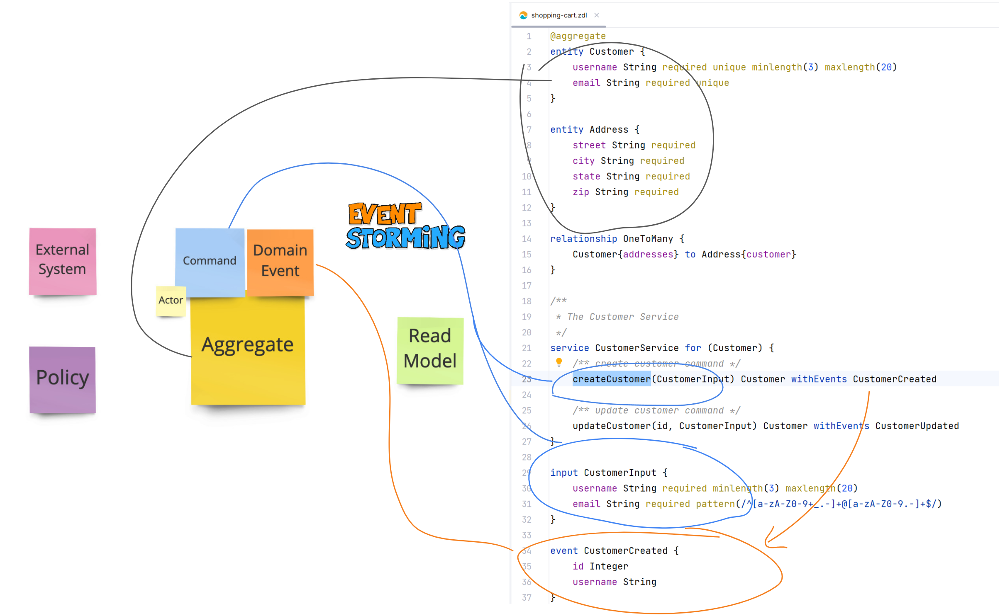

# ZenWave SDK Playground

> ZenWave SDK Helps you Create Software Easy to Understand

These are ZenWave SDK Example and Baseline Projects generated from ZenWave Model Definitions using ZenWave SDK (CLI) Plugins.

Follow instructions at: [ZenWave SDK Getting Started](https://www.zenwave360.io/docs/getting-started/)

Baseline Projects:

* [zenwave-jpa-baseline](zenwave-jpa-baseline)
* [zenwave-mongodb-baseline](zenwave-mongodb-baseline)

Example Projects:

* [examples/asyncapi-shopping-cart](examples/asyncapi-shopping-cart) AsyncAPI Shopping Cart Example
* [examples/order-fulfillment-kotlin](examples/order-fulfillment-kotlin) Order Fulfillment DDD Example (Kotlin)
* [examples/customer-address-jpa](examples/customer-address-jpa) Spring Boot + JPA + Kafka
* [examples/kustomer-address-jpa](examples/kustomer-address-jpa) Spring Boot + JPA + Kafka + Kotlin
* [examples/modulith-clinical-tool-jpa](examples/modulith-clinical-tool-jpa) Modular Monolith
* [examples/modulith-klinical-tool-jpa](examples/modulith-clinical-tool-jpa) Modular Monolith with Kotlin
* [examples/mploed-applicant-scoring](examples/mploed-applicant-scoring) (WIP) ZenWave implementation of 'Michael Plöd - Applicant Scoring' Test Project for DDD Europe Hands-On.
