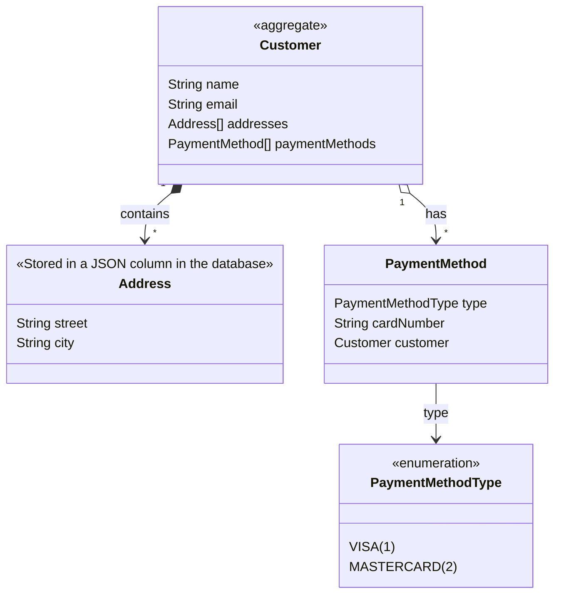
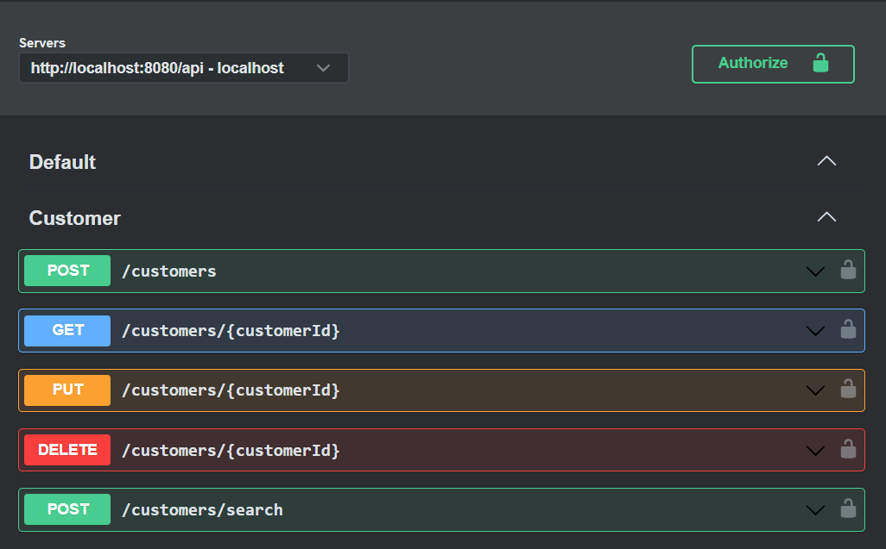
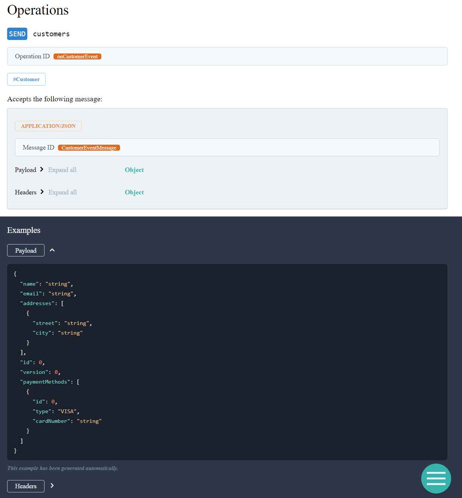

# Kustomer Address JPA Example

Kotlin + Spring-Boot example project version of Customer Address JPA Example.

This is a sample project generated with ZenWave SDK for this domain model:



With these REST Endpoints:



And these Domain Events published to a Kafka Topic:



As defined on this [ZenWave Model (zenwave-model.zdl)](zenwave-model.zdl)

And generated using this [set of plugins (zenwave-scripts.zw)](zenwave-scripts.zw) using [ZenWave Editor](https://www.zenwave360.io/plugin/) for IntelliJ IDEA.

## Requirements

* JDK 21+
* Maven 3.8.+ or Gradle 8.+
* Docker Compose: in case you don't have Docker-Compose installed in your machine, install [Rancher Desktop](https://rancherdesktop.io/) and configure `dockerd` as engine (instead of `containerd`), this will include `docker` and `docker-compose` commands in your PATH.
* Your favorite IDE

## Getting Started

Use the following commands to run the application or tests:

* Start docker dependencies:

```bash
docker-compose up -d
```

* Run the application:

```bash
# Maven
mvn spring-boot:run -Dspring-boot.run.profiles=local

# Gradle
./gradlew bootRun --args='--spring.profiles.active=local'
```

* Open [Swagger UI](http://localhost:8080/swagger-ui/index.html) in your browser.
  Use "Basic Authentication" with username `admin` and password `password` to authenticate.

* Running Unit Tests:

```bash
# Maven
mvn clean test

# Gradle
./gradlew clean test
```

* Running Unit and Integration Tests:

```bash
# Maven
mvn clean verify

# Gradle
./gradlew clean build
```

* Stop docker dependencies:

```bash
docker-compose down
```
