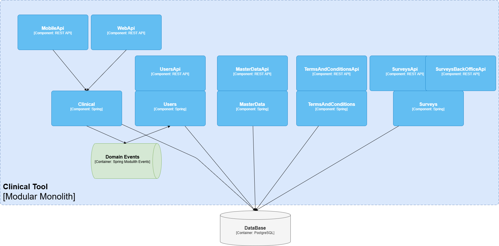

# Clinical Tool - Modulith

> Working in progress... As of now this repo only contains the code generated from ZenWave Models (about 80% of the final application).

See https://www.zenwave360.io/docs/examples/ddd-examples/modulith-klinical-tool-jpa/ for detailed steps about how this Modular Monolith was designed and implemented.

This is a modular monolith clinical management system built with Spring Boot and ZenWave SDK. The application demonstrates Domain-Driven Design principles with multiple bounded contexts organized as modules.

## Domain Model

The system is organized into the following modules:



### Clinical Module
- **Hospitals**: Medical facility management
- **Doctors**: Healthcare provider management with specializations and hospital assignments
- **Patients**: Complete patient management with personal information, contact details, and medical data

### User Management Module
- User authentication and authorization
- Role-based access control
- Account management (enabled/disabled, credentials expiration)
- Extensible user profiles with additional properties

### Documents Module
- Document upload and download with file type validation
- Document metadata management (filename, type, content type, tags)
- Binary data storage with preview capabilities
- RESTful file operations

### Master Data Module
- Centralized reference data management
- Multi-language support for translations
- Configurable data types: Gender, ID Document Types, Countries, Insurance Companies, Medical Areas
- Key-value pair structure for flexible data organization

### Terms and Conditions Module
- Version-controlled terms and conditions management
- Multi-language support
- User acceptance tracking with timestamps
- Date-based validity periods

### Surveys Module
- Generic survey management system
- Multi-language question and answer support
- Hierarchical survey structure (surveys → sections → questions)
- Both back-office and public APIs

## Requirements

* JDK 21+
* Maven 3.8.+
* Docker Compose: in case you don't have Docker-Compose installed in your machine, install [Rancher Desktop](https://rancherdesktop.io/) and configure `dockerd` as engine (instead of `containerd`), this will include `docker` and `docker-compose` commands in your PATH.
* Your favorite IDE

## Getting Started

Use the following commands to run the application or tests:

* Start docker dependencies:

```bash
docker-compose up -d
```

* Run the application:

```bash
mvn spring-boot:run
```

* Open [Swagger UI](http://localhost:8080/swagger-ui/index.html) in your browser.
  Use "Basic Authentication" with username `admin` and password `password` to authenticate.

* Running Unit Tests:

```bash
mvn clean test
```

* Running Unit and Integration Tests:

```bash
mvn clean verify
```

* Stop docker dependencies:

```bash
docker-compose down
```

