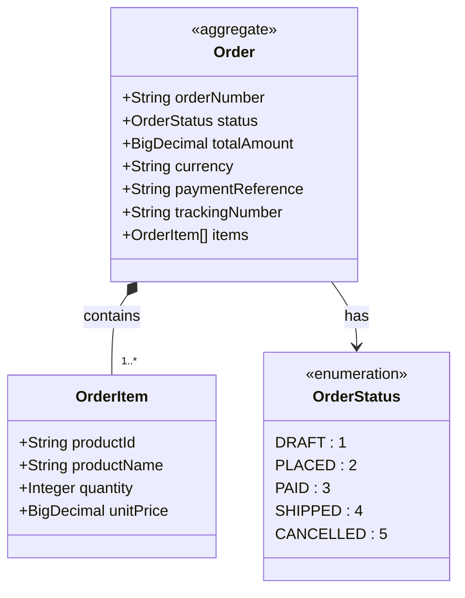

# Order Fulfillment (Kotlin)

ZenWave SDK example project for Order Fulfillment built with Kotlin and Spring Boot.

## Table of Contents

- [Order Fulfillment (Kotlin)](#order-fulfillment-kotlin)
  - [Table of Contents](#table-of-contents)
  - [Getting Started](#getting-started)
    - [Prerequisites](#prerequisites)
  - [Technologies](#technologies)
  - [Domain Model](#domain-model)
    - [Order Aggregate](#order-aggregate)
    - [Order Items](#order-items)
    - [Input Commands](#input-commands)
  - [API Documentation](#api-documentation)
    - [REST API (OpenAPI 3.0)](#rest-api-openapi-30)
    - [SwaggerUI](#swaggerui)
  - [Event-Driven Architecture](#event-driven-architecture)
    - [Event Channels](#event-channels)
    - [Event Headers](#event-headers)
  - [Code Generation](#code-generation)
    - [Generated Components](#generated-components)

## Getting Started

After cloning the project, you can start the project with the following command:

```bash
docker-compose up -d
mvn spring-boot:run
```

### Prerequisites

* Java 24
* Maven 3.6+
* Docker/Docker Compose
* Git and Git-Bash
* JBang and ZenWave SDK
* SDKMAN! (optional but highly recommended)

## Technologies

* Spring Boot 4.0.x
* Spring Data JPA with PostgreSQL
* Spring Cloud Streams for Kafka
* Spring Security
* ZenWave SDK for Domain Modeling and Code Generation

## Domain Model



This project implements an Order Fulfillment domain with the following key components:

### Order Aggregate

- **Entity**: `Order` with natural ID `orderNumber`
- **Status Flow**: DRAFT → PLACED → PAID → SHIPPED → CANCELLED
- **Properties**: orderNumber, status, totalAmount, currency, paymentReference, trackingNumber, items
- **Business Rules**: 
  - Order numbers must be unique
  - Shipped orders cannot be cancelled

### Order Items
- Stored as JSON array containing: productId, productName, quantity, unitPrice

### Input Commands
- `PlaceOrderInput`: items, currency
- `PayOrderInput`: paymentReference  
- `ShipOrderInput`: trackingNumber

## API Documentation

### REST API (OpenAPI 3.0)
The application exposes the following REST endpoints:

- `POST /api/orders` - Place a new order
- `POST /api/orders/{orderNumber}/pay` - Pay for an order
- `POST /api/orders/{orderNumber}/ship` - Ship an order
- `POST /api/orders/{orderNumber}/cancel` - Cancel an order
- `GET /api/orders/{orderNumber}` - Get order details

### SwaggerUI
SwaggerUI is available at http://localhost:8080/swagger-ui/index.html
- User: admin
- Password: password

## Event-Driven Architecture

The application publishes domain events using AsyncAPI 3.0 specification:

### Event Channels
- `orders.placed` - OrderPlaced events
- `orders.paid` - OrderPaid events  
- `orders.shipped` - OrderShipped events
- `orders.cancelled` - OrderCancelled events

### Event Headers
Events include CloudEvents headers and Kafka message keys for proper routing and traceability.

## Code Generation

This project was generated using ZenWave SDK from the domain model (`zenwave-model.zdl`) using plugins in `zenwave-scripts.zw` using IntelliJ ZenWave Domain Editor.

### Generated Components

- **Domain Entities** and **Value Objects** from ZDL model
- **REST Controllers** from OpenAPI specification
- **Event Publishers/Consumers** from AsyncAPI specification
- **DTOs and Mappers** for API boundaries
- **Test Clients** for integration testing

Happy Coding!! 🚀🚀🚀


